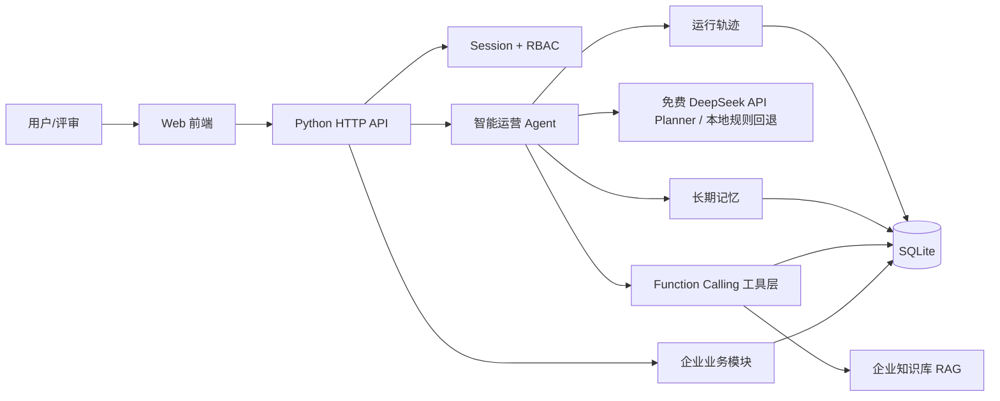
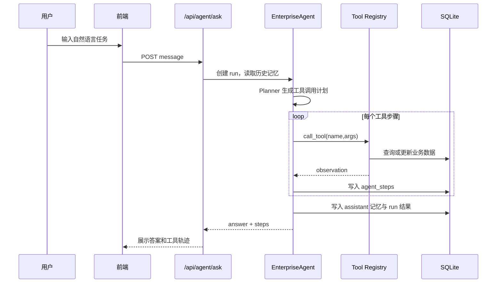
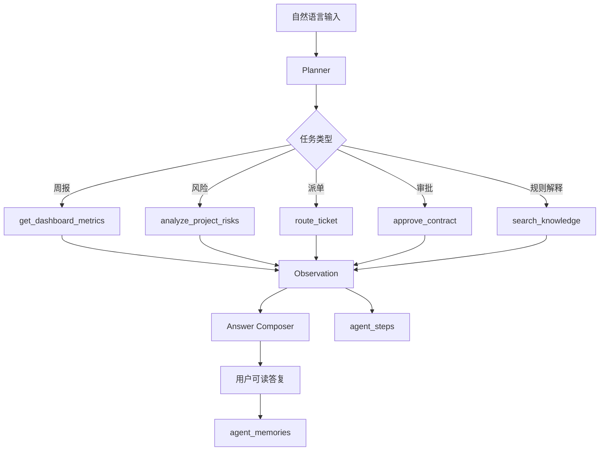

# Architecture Spec

## 1. 总体架构

## 2. Agent 交互流程

## 3. 数据流设计

## 4. 分层结构

| 层级 | 文件 | 职责 |
|---|---|---|
| 表现层 | `app/static/*` | 登录、看板、业务表格、智能助手 |
| 控制层 | `app/server.py` | API 路由、鉴权、静态资源 |
| Agent 层 | `app/agent/agent.py` | 规划、执行、答案组织 |
| 工具层 | `app/agent/tools.py` | Function Calling 工具定义与实现 |
| 记忆与追踪 | `app/agent/memory.py` | run、step、memory 持久化 |
| 数据层 | `app/schema.sql`、`app/database.py` | SQLite 表结构与连接 |

## 5. 改造前 vs 改造后

| 维度 | 改造前 | 改造后 |
|---|---|---|
| 交互方式 | 菜单、表格、人工筛选 | 自然语言任务驱动 |
| 风险分析 | 人工跨模块汇总 | Agent 自动合并项目、合同、工单 |
| 工单派单 | 人工查看人员负载 | Tool Use 自动选择处理人 |
| 合同审批 | 人工进入审批页面 | Agent 调用审批工具并写审计 |
| 报告生成 | 手工统计 | 自动生成经营周报 |
| 可解释性 | 操作日志有限 | run/step/tool observation 全链路留痕 |

## 6. 扩展路线

- Planner 替换为 LangGraph 状态图，实现条件分支和失败重试。
- 接入免费 DeepSeek 兼容 API，实现真实 LLM Function Calling；当前已提供免费 API 优先、官方 API 备用和本地规则回退。
- 将知识库替换为向量数据库，实现语义 RAG。
- 将 SQLite 替换为 PostgreSQL/MySQL，并接入企业统一认证。
- 接入 OpenTelemetry 或 LangSmith 类 tracing 平台。
